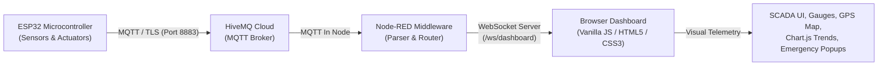

# Industrial IoT Smart Monitoring Dashboard

A mission-critical, SCADA-inspired Industrial Internet of Things (IIoT) monitoring dashboard designed for real-time facility safety, environmental telemetry, hazardous condition alerting, asset tracking, and workforce attendance tracking.

---

## 1. Project Overview

The **Industrial IoT Smart Monitoring Dashboard** is an end-to-end industrial safety management solution built to protect personnel, machinery, and facility infrastructure. Operating in harsh manufacturing and plant environments requires sub-second visibility into environmental variables, hazardous gas leaks, fire outbreaks, mechanical vibrations, and unauthorized access.

### Key Objectives
- **Real-Time Sensor Telemetry Acquisition:** Collect high-frequency readings from an on-site ESP32 micro-controller interfaced with industrial-grade sensors (temperature, humidity, combustible gases, flame, motion, vibration).
- **Secure Cloud Transport via MQTT:** Broadcast telemetry securely using MQTT over TLS to **HiveMQ Cloud**, ensuring fault-tolerant pub/sub delivery with minimal network overhead.
- **Middleware Flow Processing in Node-RED:** Ingest, parse, sanitize, and route incoming MQTT topics through a local or cloud Node-RED flow engine.
- **Low-Latency Streaming via WebSockets:** Deliver live JSON packets directly to the web client via native WebSockets (`/ws/dashboard`), eliminating client-side polling and network latency.
- **Industrial Web Dashboard:** Provide plant managers and safety engineers with a dark, high-contrast, responsive SCADA interface featuring real-time gauges, actuator monitors, interactive GPS asset mapping, rolling trend analytics, state-transition notifications, and emergency hazard overlays.

---

## 2. System Architecture

The project employs a distributed 5-tier architecture that guarantees reliable data ingestion, processing, and real-time visualization.

### Data Flow Diagram



### Architectural Tiers

1. **Edge Sensing Tier (ESP32):**
   - Interfaced with physical sensors across the plant floor.
   - Packages readings into structured JSON telemetry payloads.
   - Publishes periodically (every ~2 seconds) and triggers immediate exception events on safety alerts.
2. **Cloud Broker Tier (HiveMQ Cloud):**
   - Enterprise-grade MQTT broker hosted in the cloud.
   - Provides secure TLS encryption, authentication, persistent sessions, and QoS levels for critical industrial signals.
3. **Integration & Middleware Tier (Node-RED):**
   - Subscribes to MQTT topics (`industrial/dashboard/data`, `industrial/dashboard/status`).
   - Normalizes field names (handling both snake_case and camelCase formats).
   - Hosts a native WebSocket server endpoint at `ws://localhost:1880/ws/dashboard`.
4. **Transport Tier (Native WebSockets):**
   - Bi-directional, full-duplex TCP stream delivering JSON packets to connected web clients with zero HTTP request overhead.
5. **Presentation Tier (Smart Monitoring Web Dashboard):**
   - Single-page interface built with vanilla web standards (HTML5, CSS3, JavaScript ES6+).
   - Zero heavyweight frontend framework dependencies (No React, Vue, Angular, Bootstrap, or Tailwind).
   - High-performance visual updates via Chart.js canvas elements and Leaflet.js mapping.

---

## 3. Features

Every feature listed below is fully implemented and operational within the codebase:

### Environmental & Safety Telemetry
- **Real-Time Temperature Monitoring:** Continuous gauge tracking scaled from 0 to 60 °C with dynamic color thresholds (`NORMAL`, `ELEVATED` at >32 °C, `HIGH WARNING` at >40 °C).
- **Humidity Monitoring:** Relative humidity gauge tracking scaled from 0 to 100 % with warning pills on threshold violations.
- **Gas Concentration Monitoring:** Wide-spectrum gas gauge calibrated from 0 to 4100 ppm with distinct alert pills (`NORMAL`, `ELEVATED` at >1000 ppm, `DANGER` at >2000 ppm).
- **Flame Detection:** Optical IR detection with instant visual card transition between `NORMAL` (green) and `DANGER` (flashing red).
- **Hazardous Gas Status:** Secondary digital boolean alarm flag (`NORMAL` / `DANGER`) for toxic or explosive gas surges.
- **PIR Motion Detection:** Passive infrared occupancy tracking indicating `NORMAL` or `DETECTED`.
- **Vibration Sensing:** Piezoelectric/mechanical vibration sensing indicating `NORMAL` or `DETECTED` for early equipment malfunction warning.

### Industrial Actuator Status
- **Cooling Fan Status:** Read-only digital status indicator displaying `FAN ON` (cyan) or `FAN OFF` (muted).
- **Exhaust Fan Status:** Read-only status indicator displaying `FAN ON` or `FAN OFF`.
- **Main Access Gate Status:** Read-only entry monitor displaying `OPEN` (cyan) or `CLOSED` (muted).
- **Emergency Exit Gate Status:** Read-only egress monitor displaying `OPEN` or `CLOSED`.

### Connectivity, Resilience & Offline Handling
- **Strict Binary Device Status:** Header indicator strictly maintains `ONLINE` or `OFFLINE` (never ambiguous states like `WAITING` or `UNKNOWN`).
- **Decoupled Transport Logic:** WebSocket connection to Node-RED does not falsely mark the device online; the device is confirmed `ONLINE` strictly when genuine ESP32 telemetry packets arrive.
- **10-Second Watchdog Inactivity Timeout:** If the ESP32 ceases transmission for more than 10 seconds (`DEVICE_OFFLINE_TIMEOUT = 10000`), the dashboard automatically transitions to `OFFLINE`.
- **Non-Destructive Offline State:** When the ESP32 disconnects, **all displayed sensor readings, gauges, fans, gates, and safety states are preserved at their last known values** (never wiped to 0 or reset).
- **No Automatic Page Reloads:** Zero destructive page refreshes (`location.reload()` is strictly avoided). The UI state remains persistent and resumes smoothly upon packet arrival.
- **Automatic WebSocket Reconnection:** Debounced 3-second retry loop gracefully reconnects if the Node-RED WebSocket drops.

### Alarms, History & Worksite Management
- **Live Safety Emergency Overlay:** Instant modal banner triggered if any safety condition occurs (`flame`, `gas_high`, `pir`, or `vibration`), displaying active condition pills (`🔥 FLAME DETECTED`, `☣ HIGH GAS DETECTED`, `👤 MOTION DETECTED`, `⚠ VIBRATION DETECTED`). Dismisses only when all hazards clear.
- **Real-Time Notification System:** Filterable alert drawer (ALL, CRITICAL, WARNING, INFO) with unread badge counter, localStorage persistence, and single-event state transition filtering (no notification spam).
- **Dual-Axis Rolling Sensor History:** 100-point FIFO buffer graphing Temperature/Humidity on the left Y-axis (0–100) and Gas Concentration on the right Y-axis (0–4100 ppm) with real-time CSV export.
- **Interactive GPS Tracking Module:** Embedded Leaflet.js map with OpenStreetMap tiles, pulsing live beacon marker, and live telemetry for Latitude, Longitude, Altitude, Speed, and Satellite count.
- **Employee Attendance & Safety Panel:** Industrial attendance table recording single daily entries per employee with strictly formatted `IN TIME`, `OUT TIME`, employee roles, status pills, and integrated safety status badge.

---

## 4. Dashboard User Interface

The frontend is modeled after modern SCADA and DCS (Distributed Control System) consoles, balancing aesthetic glassmorphism with high visibility in low-light industrial control rooms.

### Layout Breakdown

```
┌────────────────────────────────────────────────────────────────────────┐
│ [Logo] SMART MONITORING  | [HOME] [EMPLOYEE] [HISTORY] [NOTIFICATIONS] │
│                          | Device: [● ONLINE/OFFLINE]  Clock: [Time]   │
├────────────────────────────────────────────────────────────────────────┤
│                      TOP SENSORS TELEMETRY (3 GAUGES)                  │
│   ┌────────────────────┐┌────────────────────┐┌────────────────────┐   │
│   │  TEMPERATURE GAUGE ││   HUMIDITY GAUGE   ││     GAS GAUGE      │   │
│   │     0 - 60 °C      ││     0 - 100 %      ││    0 - 4100 ppm    │   │
│   └────────────────────┘└────────────────────┘└────────────────────┘   │
├────────────────────────────────────────────────────────────────────────┤
│                     SAFETY SENSORS & ACTUATOR STATUS                   │
│   [Flame: NORMAL] [Gas: NORMAL] [Motion: NORMAL] [Vibration: NORMAL]   │
│   [Cooling Fan: OFF] [Exhaust Fan: OFF] [Main Gate: CLOSED] [Emerg: CL]│
├────────────────────────────────────────────────────────────────────────┤
│                       OPERATIONAL PANELS                               │
│   ┌───────────────────────────────────┐┌───────────────────────────┐   │
│   │ EMPLOYEE ATTENDANCE & SAFETY      ││ LIVE GPS ASSET LOCATION   │   │
│   │ • Emp ID, Name, Role, In, Out     ││ • Interactive Leaflet Map │   │
│   │ • System Safety Status Badge      ││ • Lat/Lon/Alt/Speed/Sats  │   │
│   └───────────────────────────────────┘└───────────────────────────┘   │
└────────────────────────────────────────────────────────────────────────┘
```

### Technologies Used
- **HTML5:** Semantic, accessible document structure.
- **CSS3:** Custom properties (CSS variables), Flexbox, CSS Grid, glassmorphism (`backdrop-filter`), keyframe glow animations, high-contrast dark theme.
- **Vanilla JavaScript (ES6+):** Modular event handling, state machine, WebSocket client, FIFO data buffering.
- **Chart.js (v4.4.1):** Semi-doughnut gauges with cutout needle rendering and dual-axis responsive time-series line chart.
- **Leaflet.js (v1.9.4):** Hardware-accelerated tile mapping with custom HTML marker pins and pulsing CSS radar rings.
- **Font Awesome (v6.4.0):** Standard industrial iconography for sensors, actuators, and alert badges.

---

## 5. Hardware Components

The following hardware modules interface directly with the ESP32 microcontroller:

| Component | Hardware Model / Module | Purpose |
|---|---|---|
| **Microcontroller** | ESP32-WROOM-32 / NodeMCU ESP32 | Main IoT processing unit, Wi-Fi stack, and sensor aggregator |
| **Temperature & Humidity Sensor** | DHT11 / DHT22 | Ambient environment monitoring inside the industrial enclosure |
| **Gas Concentration Sensor** | MQ-2 / MQ-135 (Analog) | Detection of flammable gases, smoke, LPG, methane, and CO (0–4100 ppm) |
| **Flame Detection Sensor** | YG1006 / IR Flame Sensor (Digital) | Optical infrared flame detection for immediate fire warning |
| **Motion Detection Sensor** | HC-SR501 PIR Sensor | Passive infrared detection of unauthorized movement or occupancy |
| **Vibration Sensor** | SW-420 / 801S Vibration Sensor | Mechanical vibration and structural shock monitoring |
| **GPS Tracking Module** | u-blox NEO-6M GPS | Geolocation, speed, altitude, and satellite tracking via UART |
| **Cooling Fan Actuator** | 5V/12V DC Brushless Fan via Relay | Automated or manual ventilation for equipment cooling |
| **Exhaust Fan Actuator** | Industrial Exhaust Fan via Relay | Evacuation of accumulated hazardous fumes or heat |
| **Main Access Gate** | Solenoid / Servo / Limit Switch | Monitored perimeter access control point |
| **Emergency Exit Gate** | Magnetic Lock / Fail-Safe Solenoid | Monitored emergency egress portal |

---

## 6. Software and Technologies

| Technology | Layer | Role in Project |
|---|---|---|
| **ESP32 Firmware (C++)** | Edge Device | Reads sensor GPIOs, formats JSON, publishes to MQTT over TLS |
| **Arduino IDE** | Tooling | Compilation and flashing of ESP32 firmware |
| **MQTT Protocol (v3.1.1 / v5.0)** | Transport | Lightweight pub/sub messaging across constrained networks |
| **HiveMQ Cloud** | Cloud Broker | Fully managed cloud MQTT broker with TLS encryption (Port 8883) |
| **Node-RED** | Middleware | Flow engine connecting HiveMQ MQTT topics to WebSocket clients |
| **WebSockets (ws://)** | Transport | Full-duplex local socket pipe (`/ws/dashboard`) to browser clients |
| **HTML5** | Frontend | Accessible markup for gauges, telemetry tables, and modals |
| **CSS3** | Frontend | Modern dark industrial SCADA stylesheet with neon status indicators |
| **Vanilla JavaScript** | Frontend | Core application logic, connection watchdog, state management |
| **Chart.js** | Presentation | Dynamic gauges and multi-axis sensor historical trends |
| **Leaflet.js** | Presentation | Real-time map rendering using OpenStreetMap tiles |
| **Font Awesome 6** | Presentation | Scalable vector icons for industrial indicators |

---

## 7. MQTT Communication

Communication between the physical plant and the control software relies on MQTT over TLS for reliability and cloud integration.

### Topic Structure

| MQTT Topic | Publisher | Subscriber | Description |
|---|---|---|---|
| `industrial/dashboard/data` | ESP32 | Node-RED | Main real-time telemetry stream published every ~2 seconds or upon hazard interrupt |
| `industrial/dashboard/status` | ESP32 | Node-RED | Device lifecycle events (e.g. MQTT Last Will & Testament `OFFLINE` and boot `ONLINE`) |
| `industrial/dashboard/command` | Node-RED / Dashboard | ESP32 | Downlink command channel for actuators, gates, and threshold adjustments |

### Telemetry JSON Payload

The ESP32 publishes sensor readings to `industrial/dashboard/data` in the following format:

```json
{
  "type": "industrial_sensor_data",
  "device_id": "ESP32-SAFETY-01",
  "device_status": "ONLINE",
  "temperature": 34.5,
  "humidity": 67.2,
  "gas": 1300,
  "pir": false,
  "flame": false,
  "vibration": false,
  "gas_high": false,
  "cooling_fan": false,
  "exhaust_fan": false,
  "main_gate": false,
  "emergency_gate": false
}
```

### Data Pipeline Flow
1. **ESP32 Publisher:** Scans analog and digital pins, packs values into the JSON structure, and transmits via `PubSubClient` or `WiFiClientSecure` to `HiveMQ Cloud`.
2. **HiveMQ Cloud Broker:** Validates credentials, handles SSL handshake, and routes the packet to subscribed Node-RED clients.
3. **Node-RED Ingestion:**
   - An `mqtt in` node listening on `industrial/dashboard/data` receives the raw string.
   - A `json` node parses the payload into a JavaScript object.
   - A `websocket out` node broadcasts the parsed object to path `/ws/dashboard`.
4. **Dashboard WebSocket Ingestion:**
   - The dashboard's `processLiveData(data)` validates `data.type === "industrial_sensor_data"`.
   - Records `lastDataReceivedAt = Date.now()`.
   - Transitions UI status to `ONLINE`.
   - Updates gauges, cards, history buffers, and emergency overlay without page refreshes.

---

## 8. Getting Started & Setup

### Prerequisites
- Modern web browser (Chrome, Edge, Firefox, Safari).
- Node-RED installed locally (`npm install -g node-red`) or running in Docker.
- HiveMQ Cloud free cluster or self-hosted MQTT broker.
- ESP32 development board and connected sensors.

### Running the Dashboard Locally

1. **Clone or Download the Repository:**
   ```bash
   git clone https://github.com/your-username/IoT_Industrial_sefty.git
   cd IoT_Industrial_sefty
   ```

2. **Configure Node-RED Flow:**
   - Add an **MQTT in** node configured for your HiveMQ Cloud cluster:
     - **Server:** `your-cluster.hivemq.cloud`
     - **Port:** `8883` (SSL/TLS enabled)
     - **Topic:** `industrial/dashboard/data`
   - Connect the output to a **JSON** parser node.
   - Connect the parser node to a **WebSocket out** node:
     - **Type:** `Listen on`
     - **Path:** `/ws/dashboard`
     - **Send/Receive:** `payload`

3. **Launch the Web Dashboard:**
   - Open `index.html` directly in your browser:
     ```bash
     start index.html
     ```
   - Or serve with any static web server:
     ```bash
     npx serve .
     ```

4. **Verify Connectivity:**
   - When opened, the dashboard header shows `OFFLINE` by default.
   - Once Node-RED forwards the first valid `industrial_sensor_data` packet, the header indicator smoothly switches to `ONLINE`.

---

## 9. License & Credits

Developed as part of an Advanced Industrial IoT & Safety Systems initiative. Designed for engineering portfolios, industrial automation prototyping, and academic capstone presentations.
